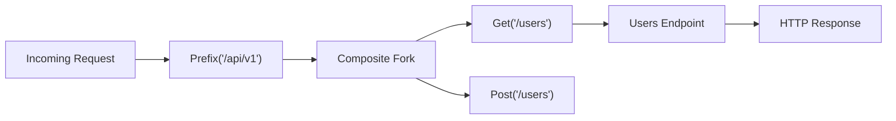

# Routing in `pyresponse`

> Pure OOP and Elegant Objects composable routing specification and guide.

In `pyresponse`, routing is not achieved through procedural framework annotations or routing decorators (such as `@app.get(...)`). Instead, routing is built by composing **`Fork`** objects into a clean, hierarchical tree.

---

## Table of Contents

1. [Core Concepts](#1-core-concepts)
2. [Exact Path Matching (`Path`)](#2-exact-path-matching-path)
3. [HTTP Method Forks (`Get`, `Post`, `Put`, `Delete`, etc.)](#3-http-method-forks-get-post-put-delete-etc)
4. [Path Prefixes & Modular Sub-Routers (`Prefix`)](#4-path-prefixes--modular-sub-routers-prefix)
5. [Regex Matching & Path Parameters (`Regex`, `PathParams`)](#5-regex-matching--path-parameters-regex-pathparams)
6. [Composite Routing & Fallbacks (`Fork`, `Fallback`)](#6-composite-routing--fallbacks-fork-fallback)
7. [Exception Trapping & Error Mapping (`Trap` / `Catch`)](#7-exception-trapping--error-mapping-trap--catch)
8. [Complete Composed Example](#8-complete-composed-example)

---

## 1. Core Concepts

Every route in `pyresponse` adheres to two core protocols:

- **`Fork`**: Evaluates an incoming `Request` and returns a matching `Endpoint` (or `Unmatched`).
- **`Endpoint`**: Receives a `Request` and produces an HTTP `Response`.



---

## 2. Exact Path Matching (`Path`)

The `Path` fork matches the exact URI path of a request:

```python
from pyresponse.fork import Path
from pyresponse.response import OK, Text

route = Path("/about", lambda req: OK(Text("About PyResponse")))
```

---

## 3. HTTP Method Forks (`Get`, `Post`, `Put`, `Delete`, etc.)

`pyresponse` provides dedicated method forks for all standard HTTP methods:
- `Get`
- `Post`
- `Put`
- `Delete`
- `Patch`
- `Options`
- `Head`

### Combined Method & Path (2-argument form)
```python
from pyresponse.fork import Delete, Fork, Get, Post
from pyresponse.response import Created, Json, NoContent, OK

routes = Fork(
    Get("/users", lambda req: OK(Json([{"id": 1, "name": "Alice"}]))),
    Post("/users", lambda req: Created(Json({"status": "created"}))),
    Delete("/users/1", lambda req: NoContent()),
)
```

### Standalone Method Filter (1-argument form)
Can be nested inside any path matcher:

```python
from pyresponse.fork import Fork, Get, Path, Post
from pyresponse.response import OK, Text

item_resource = Path(
    "/item",
    Fork(
        Get(lambda req: OK(Text("Fetched item"))),
        Post(lambda req: OK(Text("Created item"))),
    ),
)
```

---

## 4. Path Prefixes & Modular Sub-Routers (`Prefix`)

The `Prefix` fork strips a path prefix and delegates to child forks. This allows mounting sub-routers without repeating URL prefixes:

```python
from pyresponse.fork import Fork, Get, Post, Prefix
from pyresponse.response import Json, OK

# Sub-router for /users
users_router = Prefix(
    "/users",
    Fork(
        Get("/", lambda req: OK(Json(["Alice", "Bob"]))),
        Post("/", lambda req: OK(Json({"created": True}))),
    ),
)

# Root router mounting /api/v1
app = Prefix(
    "/api/v1",
    Fork(
        users_router,
        Get("/health", lambda req: OK(Json({"status": "healthy"}))),
    ),
)
```

---

## 5. Regex Matching & Path Parameters (`Regex`, `PathParams`)

The `Regex` fork matches URI paths using regular expressions with named capture groups. Extracted path parameters are accessed via the `PathParams` inspector:

```python
from pyresponse.fork import Regex
from pyresponse.request import PathParams
from pyresponse.response import Json, OK

async def user_detail(req):
    user_id = await PathParams(req).param("user_id")
    return OK(Json({"user_id": user_id}))

route = Regex(r"^/users/(?P<user_id>\d+)$", user_detail)
```

---

## 6. Composite Routing & Fallbacks (`Fork`, `Fallback`)

The `Fork` class groups multiple branches and evaluates them in order until a match is found:

```python
from pyresponse.fork import Fallback, Fork, Get
from pyresponse.response import NotFound, OK, Text

# Pure composite evaluating routes
routes = Fork(
    Get("/items", lambda req: OK(Text("Items list"))),
    Get("/contact", lambda req: OK(Text("Contact us"))),
)

# Explicit fallback decorator when no route matches
app = Fallback(
    routes,
    fallback=lambda req: NotFound(Text("Custom 404 - Not Found")),
)
```

---

## 7. Exception Trapping & Error Mapping (`Trap` / `Catch`)

`Trap` wraps a `Fork` or `Endpoint` and intercepts domain exceptions, converting them into structured HTTP responses:

```python
from pyresponse import BadRequest, ServerError, Trap
from pyresponse.fork import Get
from pyresponse.request import Header, HeaderNotFoundError, ParamNotFoundError
from pyresponse.response import Json, OK

async def secure_endpoint(req):
    token = await Header(req, "Authorization").value()
    return OK(Json({"token": token}))


app = Trap(
    Get("/secure", secure_endpoint),
    traps={
        HeaderNotFoundError: lambda exc, req: BadRequest(
            Json({"error": f"Missing header: {exc.name()}"})
        ),
        ParamNotFoundError: lambda exc, req: BadRequest(
            Json({"error": f"Missing parameter: {exc.name()}"})
        ),
        Exception: lambda exc, req: ServerError(
            Json({"error": "Internal Server Error", "detail": str(exc)})
        ),
    },
)
```

---

## 8. Complete Composed Example

`pyresponse` allows endpoints to be written as first-class domain objects (the purest OOP approach) or functions:

```python
from pyresponse import (
    BadRequest,
    Created,
    Endpoint,
    Fork,
    Get,
    Json,
    OK,
    Post,
    Prefix,
    Regex,
    Request,
    Response,
    Server,
    Text,
    Trap,
)
from pyresponse.request import (
    Json as RequestJson,
    ParamNotFoundError,
    PathParams,
)


# 1. Pure OOP First-Class Domain Endpoints
class UserList(Endpoint):
    """Endpoint representing user collection resource."""

    async def response(self, request: Request) -> Response:
        return OK(Json([{"id": "1", "name": "Alice"}, {"id": "2", "name": "Bob"}]))


class CreateUser(Endpoint):
    """Endpoint handling user creation."""

    async def response(self, request: Request) -> Response:
        data = await RequestJson(request).content()
        return Created(Json({"status": "created", "user": data}))


class UserDetail(Endpoint):
    """Endpoint representing an individual user entity."""

    async def response(self, request: Request) -> Response:
        user_id = await PathParams(request).param("user_id")
        return OK(Json({"id": user_id, "name": f"User {user_id}"}))


# 2. Composed Routing Tree
users_router = Prefix(
    "/users",
    Fork(
        Get("/", UserList()),
        Post("/", CreateUser()),
        Regex(r"^/(?P<user_id>\d+)$", Get(UserDetail())),
    ),
)

app = Trap(
    Prefix(
        "/api/v1",
        Fork(
            users_router,
            Get("/health", lambda req: OK(Text("healthy"))),
        ),
    ),
    traps={
        ParamNotFoundError: lambda exc, req: BadRequest(
            Json({"error": f"Missing parameter: {exc.name()}"})
        ),
    },
)

if __name__ == "__main__":
    Server(app, host="127.0.0.1", port=8000).start()
```
